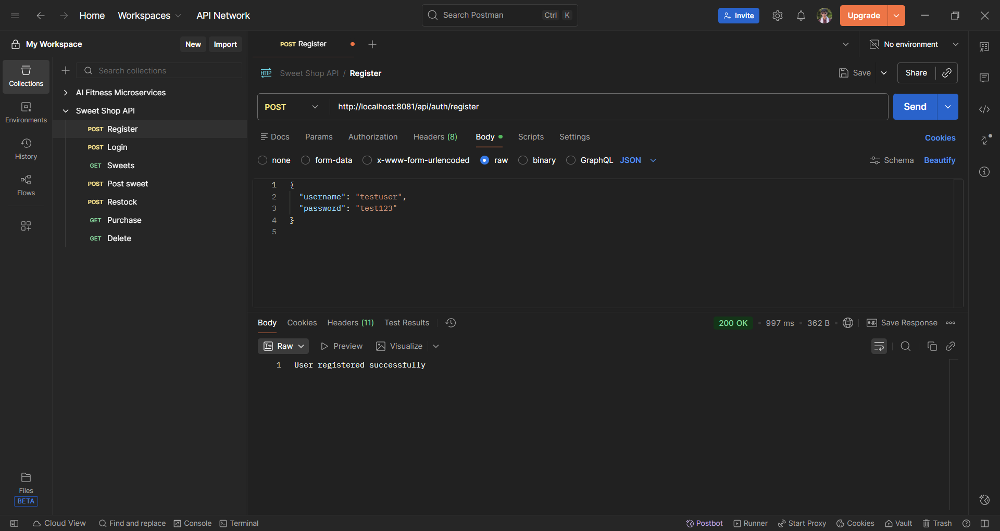
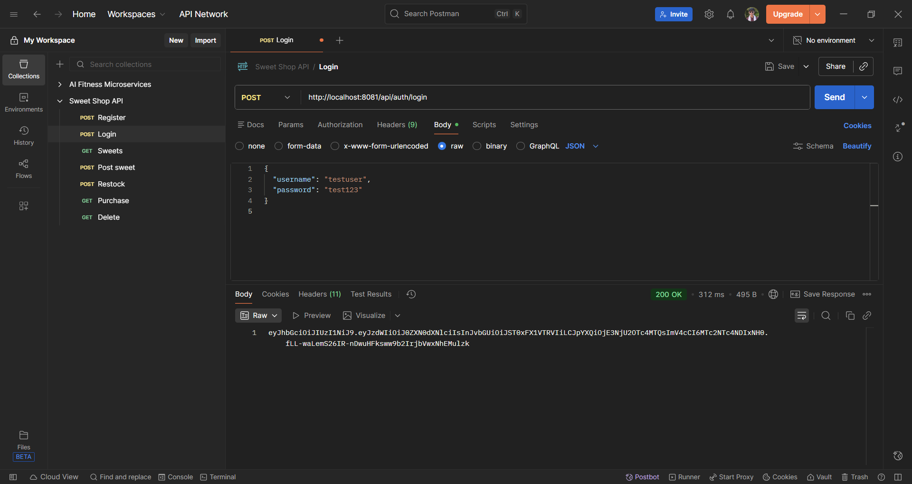
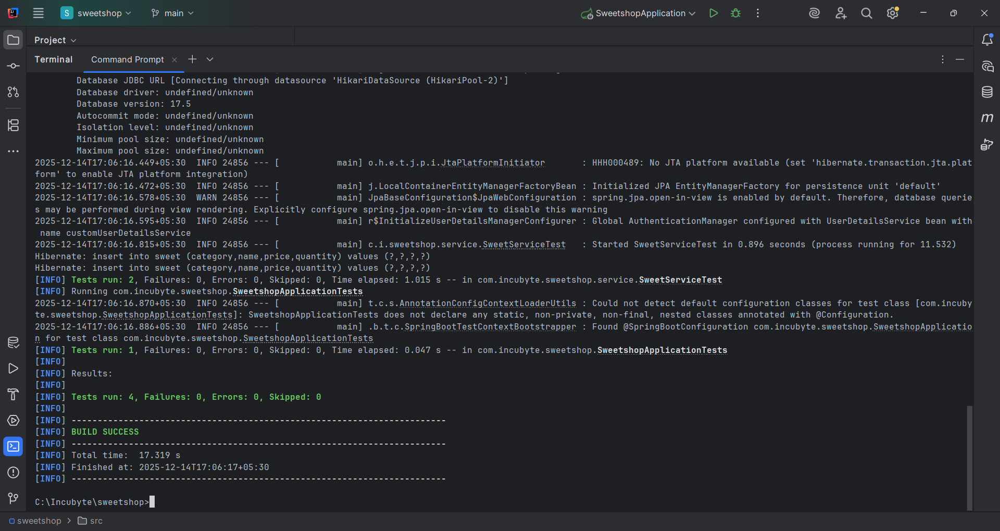

# Sweet Shop Management System – Backend

## 1. Project Overview

The **Sweet Shop Management System** is a RESTful backend application developed using **Spring Boot**.  
It provides APIs to manage sweets inventory, handle purchases and restocking, and enforce role-based access using **JWT authentication**.

This project was implemented as part of the **Incubyte Assignment**, with emphasis on:

- Clean and maintainable code
- Test-Driven Development (TDD)
- Secure authentication and authorization
- Transparent and responsible use of AI tools

---

## 2. Technology Stack

| Category | Technology |
|--------|------------|
| Backend | Java 21, Spring Boot |
| Security | Spring Security, JWT |
| Database | PostgreSQL |
| ORM | Spring Data JPA, Hibernate |
| Testing | Spring Boot Test |
| Build Tool | Maven |
| API Client | Postman |

---

## 3. Features Implemented

### Authentication & Authorization
- User registration and login
- JWT-based token authentication
- Role-based access control (`ROLE_USER`, `ROLE_ADMIN`)

### Sweet Management
- Add new sweets (Admin only)
- View all sweets
- Search sweets by name, category, and price range
- Update sweet details (Admin only)
- Delete sweets (Admin only)

### Inventory Management
- Purchase sweets (quantity decreases)
- Restock sweets (Admin only)

Each sweet has a unique:
- ID
- Name
- Category
- Price
- Quantity in stock

---

## 4. API Endpoints

All APIs are secured using JWT authentication unless stated otherwise.

### Authentication APIs

| Method | Endpoint | Description |
|------|---------|-------------|
| POST | `/api/auth/register` | Register a new user |
| POST | `/api/auth/login` | Login and receive JWT token |


### Sweet Management APIs (Protected)

| Method | Endpoint | Access |
|------|---------|--------|
| POST | `/api/sweets` | Add a new sweet (Admin only) |
| GET | `/api/sweets` | Get all sweets (User/Admin) |
| GET | `/api/sweets/search` | Search sweets by name, category, price |
| PUT | `/api/sweets/{id}` | Update sweet details (Admin only) |
| DELETE | `/api/sweets/{id}` | Delete sweet (Admin only) |


### Inventory APIs (Protected)

| Method | Endpoint | Access |
|------|---------|--------|
| POST | `/api/sweets/{id}/purchase` | Purchase a sweet |
| POST | `/api/sweets/{id}/restock` | Restock sweet (Admin only) |


---

## API Screenshots (Postman)

The following screenshots demonstrate successful execution of the backend APIs using Postman.

### Authentication

**1] Register**


**2] Login**


**3] Admin Login**


---

### Sweet Management

**4] Add Sweet (Admin Only)**
.png)

**5] Get All Sweets**
.png)

**6] Search Sweets**


**7] Update Sweet**
.png)

---

## 5. Test-Driven Development (TDD)

The backend includes automated tests to validate core business logic and API behavior.

### Test Types Implemented

- **Service Layer Tests**
  - Validate sweet creation, retrieval, and inventory updates.
  - Ensure business rules such as stock reduction during purchase.
- **Application Context Test**
  - Verifies that the Spring Boot application loads successfully.

### Running Tests Locally

To execute the full test suite, run the following command from the project root:

```bash
mvn test 
```
## Test Report

The following screenshot shows the successful execution of the backend test suite using Maven.



---

## 6. Local Setup & Execution (Backend)

This section explains how to set up and run the backend application locally.

### Prerequisites

Ensure the following tools are installed on your system:

- Java 21
- Maven 3.9+
- PostgreSQL 14+
- Git

### Database Setup

1. Create a PostgreSQL database:

```sql
CREATE DATABASE sweetshop;
```

2. Configure database credentials in the application configuration file:

```yaml
spring:
  datasource:
    url: jdbc:postgresql://localhost:5432/sweetshop
    username: postgres
    password: <your_password>
```
### Local Setup & Execution (Backend)

1. Clone the Repository
```bash
git clone https://github.com/Aditya201003/sweet-shop-management-system.git
cd sweet-shop-management-system
```
2. Build the Project
```bash
mvn clean install
```
3. Run the Backend Application
```bash
mvn spring-boot:run
```
4. The backend server will start on:
```bash
http://localhost:8081
```

### Authentication Flow

1. Register a User
```bash
POST /api/auth/register
```
2. Login
```bash
POST /api/auth/login
```
3. JWT Token Usage - After successful login, copy the returned JWT token and add it to Postman headers:
```bash
Authorization: Bearer <JWT_TOKEN>
```

## Role-Based Access Control
- **Admin-only endpoints require a token with ROLE_ADMIN**
- **User endpoints can be accessed using ROLE_USER or ROLE_ADMIN**

---

## 7. My AI Usage
AI tools were used responsibly during the development of this project to improve productivity, debugging efficiency, and documentation quality. All architectural decisions, business logic, and final implementations were reviewed, validated, and written by me.

### AI Tools Used
- **ChatGPT (OpenAI)**

### How AI Was Used
- Assisted in debugging complex **Hibernate and PostgreSQL query issues**, specifically resolving parameter type mismatches (`bytea` vs `text`) when using nullable query parameters with `LIKE` and `LOWER`.
- Helped analyze **Hibernate-generated SQL errors** and identify root causes related to PostgreSQL parameter binding.
- Assisted in debugging **JWT signature validation issues** and structuring the **Spring Security filter chain** correctly.
- Supported writing and refining **service-layer and controller-level test cases**.
- Helped structure **REST API endpoints**, request/response DTOs, and validation logic.
- Assisted in organizing and refining **README documentation**, including test reports and setup instructions.

### Reflection on AI Usage
- AI acted as a productivity and debugging assistant rather than a source of copied code.
- All AI-generated suggestions were critically evaluated, adapted, and integrated manually to ensure correctness, maintainability, and originality.
- Using AI reduced debugging time and improved documentation clarity while preserving full ownership of the design and implementation decisions.
  
### AI Co-authorship Transparency
For commits where AI assistance was used for debugging or structural guidance, the following co-author attribution was added as required:
```text
Co-authored-by: ChatGPT <AI@users.noreply.github.com>
```
---
## Project Scope Note

This repository currently contains the **backend implementation** of the Sweet Shop Management System.

Due to time constraints and my stronger expertise in backend development, I prioritized designing and delivering a robust, secure, and well-tested backend API. The backend fully implements authentication, authorization, business logic, database integration, and automated testing as per the assignment requirements.

I am actively working on the **frontend implementation**, and once completed, the following will be added to this repository:

- Frontend source code
- Deployment link (live application)
- Updated screenshots and documentation

This phased approach allowed me to focus on delivering high-quality backend architecture and clean, maintainable code while ensuring extensibility for frontend integration.

